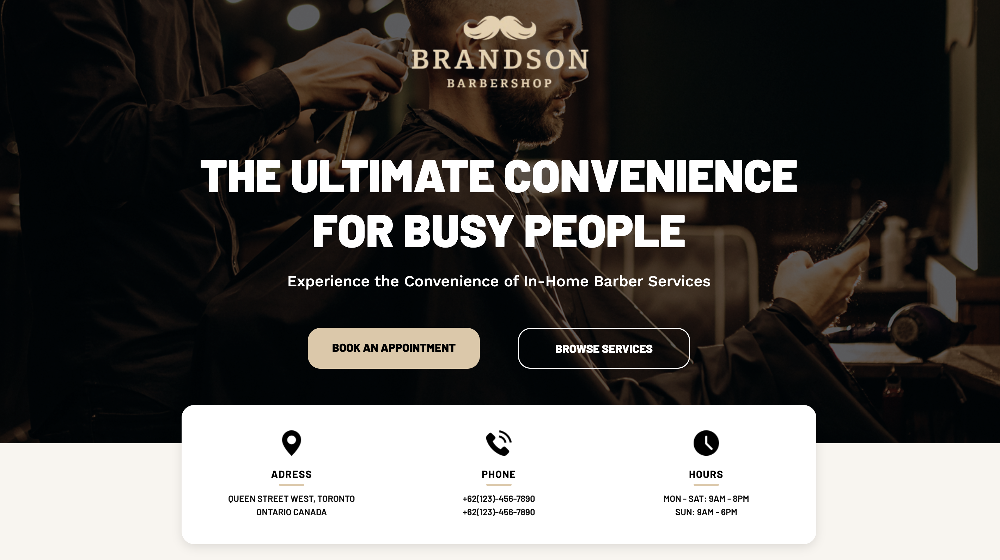
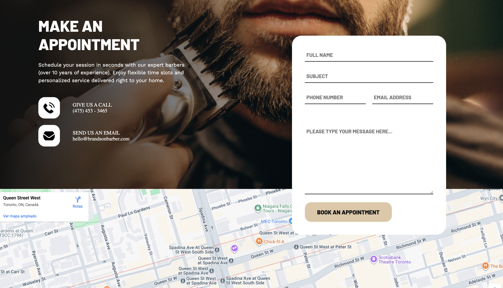

# 💈 Brandson Barbershop – Landing Page

**Brandson Barbershop** is a fictional landing page project developed for study purposes.  
It simulates a premium mobile barber service, built to practice **HTML**, **CSS**, and **JavaScript** skills.

---

## 📌 Project Overview

This project was created to simulate a real-world landing page for a barbershop offering at-home services.  
The layout is fully responsive and structured with semantic HTML. Styling was done using custom CSS only — no frameworks involved.

---

## 🧩 Main Sections

- ✅ Hero Section (logo, headline, CTA)
- ✅ About Section (mission, stats, trust indicators)
- ✅ Services (icons, prices, descriptions)
- ✅ Banner with Call to Action
- ✅ Contact Information with Icons
- ✅ Appointment Form (with embedded Google Maps)
- ✅ Footer (social media links and copyright)

---

## 🛠️ Technologies Used

- **HTML5** – page structure  
- **CSS3** – styling with Flexbox and Grid  
- **Google Maps Embed** – map integration

---

## 🎯 Purpose & Learning Goals

- Build a complete, multi-section landing page  
- Practice responsive design techniques  
- Improve understanding of semantic HTML and CSS structure  
- Embed media and icons effectively  
- Prepare for real-world front-end projects

---

## 🚀 Getting Started

1. Clone the repository:
   ```bash
   git clone https://github.com/OJhonnys/Barbershop-Brandson.git

## 📸 Screenshots

Here are some previews of the landing page layout:


> 
> 

---

## ⚠️ Disclaimer

This project is purely for educational purposes.  
**Brandson Barbershop** is a fictional brand created to improve front-end development skills.

---

## 👨‍💻 Author

Made with ❤️ by **Jhonny Da Silva** – an aspiring front-end developer passionate about clean UI and practical learning.

[](https://www.linkedin.com/in/jhonnydasilva/)
[](https://github.com/OJhonnys)

